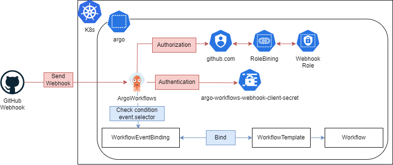
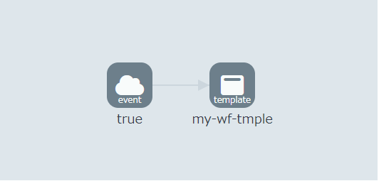
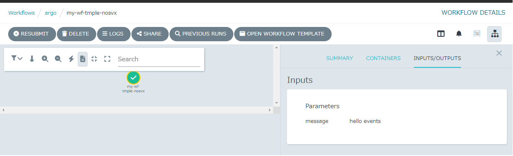
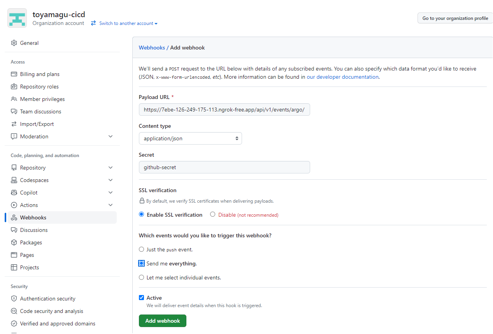
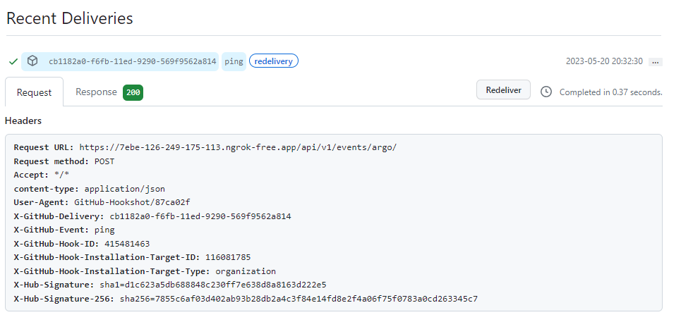
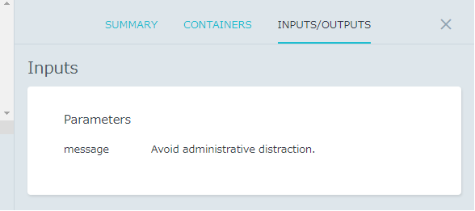

# GitHub Webhook

## Overview

## Procedure

1. Install ArgoWorkflows to your local k8s cluster
    1. `kind create cluster` (or `k3d cluster create` )
    1. `cd manifests`
    1. `helmfile sync .`
    1. `k port-forward -n argo deployments/argo-workflows-server 2746:2746`
    1. Now, we can access to `http://localhost:2746`
1. Get ServiceAccount token
    1. `ARGO_TOKEN="Bearer $(kubectl get secret -n argo admin.service-account-token -o=jsonpath='{.data.token}' | base64 --decode)"`
    1. `echo $ARGO_TOKEN`
    1. Using this token, we can login to ArgoWorkflow GUI console.
1. To get a webhook from GitHub, we should expose our local ArgoWorkflows to the internet. We use [ngrok](https://ngrok.com/).
    1. Create a ngrok account and get a token.
    1. `NGROK_AUTHTOKEN=<INSERT-YOUR-TOKEN>`
    1. `docker run -it -e NGROK_AUTHTOKEN=${NGROK_AUTHTOKEN} ngrok/ngrok:latest http http://host.docker.internal:2746`
        - It works in WSL2, but one might change this command. For a detailed description, see [ref](https://ngrok.com/docs/using-ngrok-with/docker/).
    1. Access to `https://<YOUR_DOMAIN>.ngrok-free.app`
1. Test to submit workflow
    1. `ARGO_SERVER=localhost:2746`
    1. `ARGO_GITHUB_TOKEN="Bearer $(kubectl get secret -n argo github.com.service-account-token -o=jsonpath='{.data.token}' | base64 --decode)"`
    1. `curl http://$ARGO_SERVER/api/v1/events/argo/ -H "Authorization: $ARGO_GITHUB_TOKEN" -H "X-Argo-E2E: true" -d '{"zen": "hello events"}'`
    1. We can also submit workflow from the internet.
    1. It may be interesting to see your workflow and event bindings.
       
       
1. Webhook from GitHub
    1. Create a webhook
       
    1. Send a test
       
    1. Check a workflow
       
