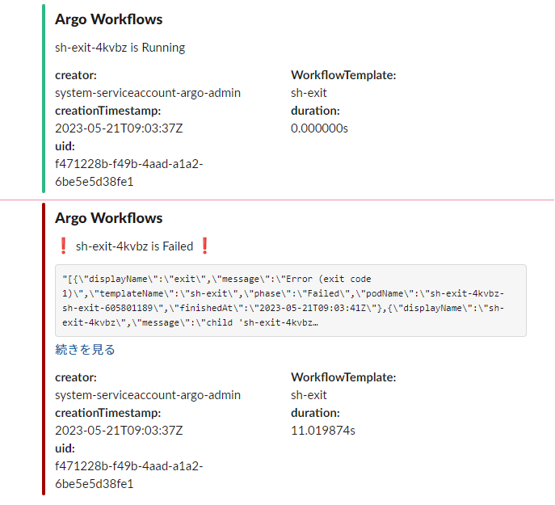

# Slack notification example

## Procedure

1. Create Slack application
1. Create Webhook URL
1. `cp sample.env .env` and insert your Webhook URL
1. `helmfile sync .`
1. If you submit workflow from `sh-exit` template with `exitcode=1`, you will get slack notification.
   
